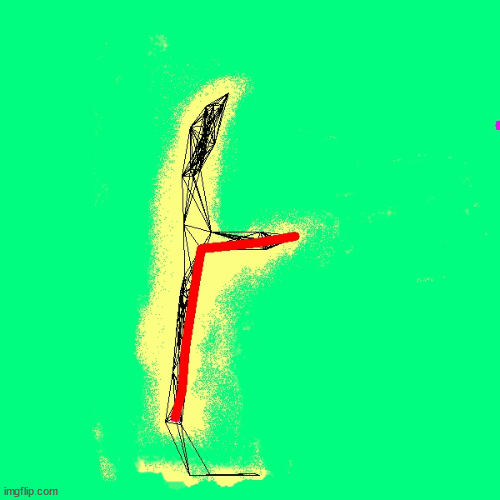

# Diplomová práca

## Popis diplomovej práce

Cieľ mojej práce je preskúmať, navrhnúť, implementovať a experimentálne overiť algoritmus prepojenia lokálnej a globálnej mapy v úlohe doručovania nákladu. Vylepšiť algoritmus zvolenia trajektórie v lokálnej mape. Rozšíriť informácie v lokálnej mape, ktoré zatiaľ tvorí výstup z lidaru a kamery o informácie z 3D kamery, aby sa robot lepšie vedel vyhýbať prekážkam a rozpoznával nerovnosti terénu. V tomto projekte budem pracovať s robotom Smelý Zajko ktorý má veľa rôznych senzorov a budem sa snažiť navrhnúť také riešenie aby úspešne vedel prechádzať križovatkami s ktorými mal doteraz velké problémy. Ako prvé na tomto projekte budem opravovať chyby predchadzajúcich diplomových prác aby fungovala lokálna mapa tak ako by mala a aby som odstránil duchov ktorý komplikujú zajkovi plánovanie cesty. Druhým cieľom je implementovať nový senzor ZED mini ktorý prinesie nové dáta ktoré zaznačím do lokálnej mapy. Tretím cieľom je navrhnúť a implementovať riešenie navigácie v križovatke aby sa robot správne rozhodol ktorou odbočkou sa má vydať v križovatke.

V mojej diplomovej práci sa zameriavam na prepojenie globálnej a lokálnej mapy v robotovi Smelý Zajko. Ďalším cieľom je integrovať dáta z kamery Zed mini do robota a vylepšiť tak lokálnu mapu o dáta z hĺbkovej mapy. Vďaka tomu bude robot vedieť lepšie vyhodnotiť prekážky na ceste.

## Priebežný postup

Z diplomovej práce mám napísanú úvodnú kapitolu aj návrh riešenia. Opravili sme pôvodnú lokálnu mapu. Program je implementovaný do robota a ladí sa len v interiéri z dôvodu nepriaznivého počasia a technických komplikacií. Kamera Zed mini je úspešne odtestovaná a komunikácia medzi kamerou a robotom funguje.

## Linky k materiálom

* [Diplomová práca PDF](main.pdf)
* [Predobhajoba](predobhajoba_slimak.pptx)
* [Zdroj 1](Fikar.pdf)
* [Zdroj 2](heuristicke_algoritmy.pdf)
* [Zdroj 3](210809117.pdf)

## Zdrojové Kódy

* [Zdrojový kód](https://github.com/Robotics-DAI-FMFI-UK/smely-zajko-ros/tree/australian)

## Knižnice

* [Zed SDK](https://github.com/stereolabs/zed-sdk)

## Animácia simulácie algoritmu

**Červená čiara predstavuje naplánovanú trasu, fialový bod v pravom hornom rohu predstavuje cieľovú pozíciu kde je miesto kam sa chce robot dostať.**

**Copyright © 2024 Bc. Martin Slimák**

